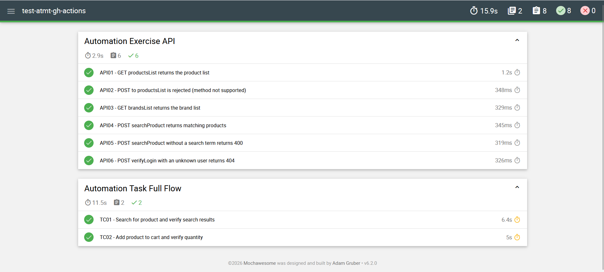

# Automation Exercise: Cypress E2E Tests

End-to-end UI tests for the demo e-commerce site [automationexercise.com](https://automationexercise.com), built with **Cypress** using the **Page Object Model**, with **Mochawesome** HTML reports and a **GitHub Actions** pipeline that runs on four browsers.


## What is tested

| ID | Scenario |
|----|----------|
| TC01 | Open the Products page, search for a product, and verify every result matches the search term |
| TC02 | Open a product, set the quantity, add it to the cart, and verify the quantity in the cart |

Test data (product name, quantity) is kept in `cypress/fixtures/product.json`, separate from the test code.

## Tech stack

- Cypress 14, JavaScript, Node.js 22
- Page Object Model (`HomePage`, `ProductsPage`, `ProductDetailsPage`, `CartPage`)
- Fixtures for test data
- Mochawesome (JSON + HTML reports)
- GitHub Actions matrix: Chrome, Firefox, Edge, Electron
- Test retries in CI (2 in run mode) to absorb network flakiness on the public demo site

## Getting started

```bash
git clone https://github.com/Naorinr95/test-atmt-gh-actions.git
cd test-atmt-gh-actions
npm ci
```

## Running the tests

Interactive mode:

```bash
npx cypress open
```

Headless mode:

```bash
npx cypress run
```

Run in a specific browser:

```bash
npx cypress run --browser chrome
```

## Reports

After a headless run, the Mochawesome report is written to:

```
cypress/reports/mochawesome-report/mochawesome.html
```



## Project structure

```
.github/workflows/main.yml   CI pipeline (4-browser matrix, report upload)
cypress/e2e/                 Test specs (executionFlow.cy.js)
cypress/pages/               Page objects
cypress/fixtures/            Test data (product.json)
cypress/support/             Commands and global setup
cypress.config.js            Cypress, retries and reporter configuration
```

## Continuous integration

On every push to `master` and on every pull request, GitHub Actions:

1. Installs dependencies with `npm ci`
2. Runs the spec on Chrome, Firefox, Edge and Electron
3. Builds a Mochawesome HTML report per browser
4. Uploads the reports as artifacts (and screenshots/videos on failure)

Open the **Actions** tab, choose a run, and download the `mochawesome-report-<browser>` artifact.

## Notes

- The site under test is a public practice application. No real accounts or data are used.
- Planned next steps: login and signup tests, a negative login case, a checkout flow, and API tests against the site's published endpoints.

## Author

**Rifat Naorin**, Software QA Engineer
[GitHub](https://github.com/Naorinr95) · [LinkedIn](https://linkedin.com/in/rifat-n)
